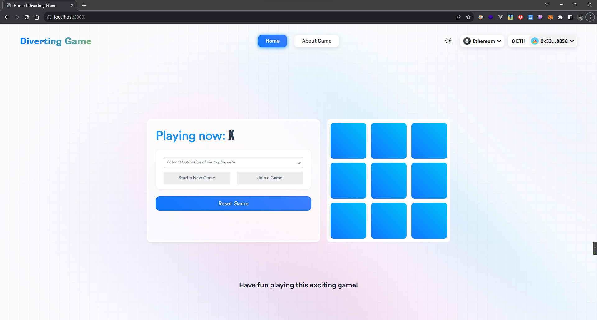
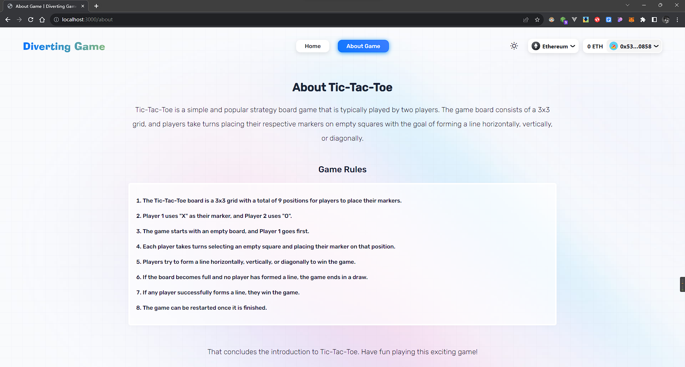
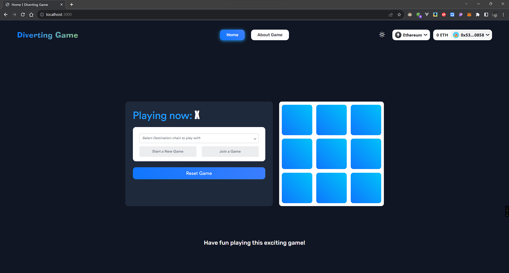
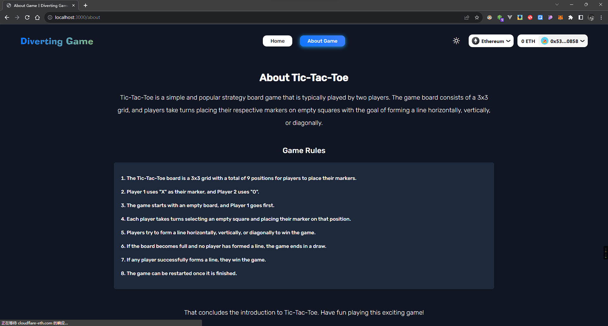
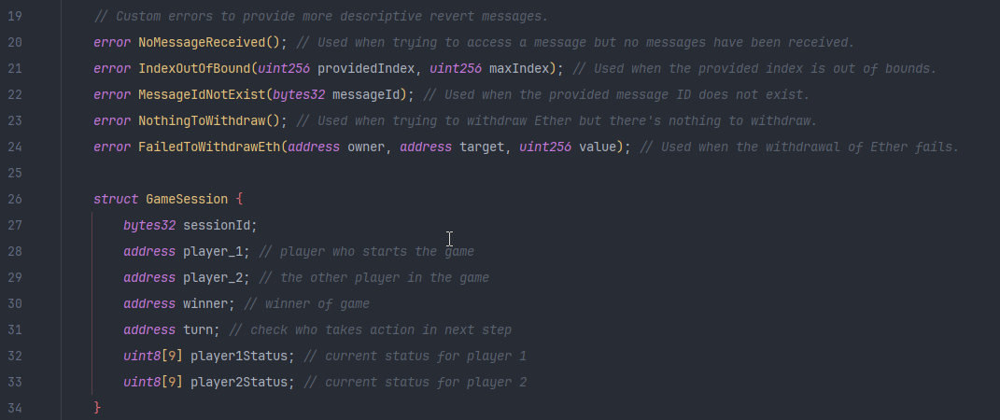

## Tic-Tac-Toe Game
This project demonstrates how Chainlink CCIP can be used to create a cross-chain Tic-Tac-Toe game.
 
### Site Preview
I used two theme modes in this project, which can be switched freely.

##### white mode:

##### dark mode:

### About Contracts 
This project uses the following contracts:
 

