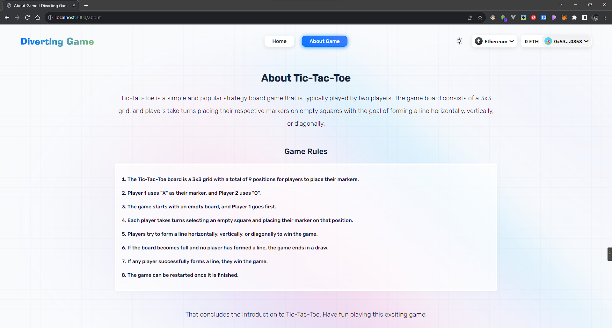
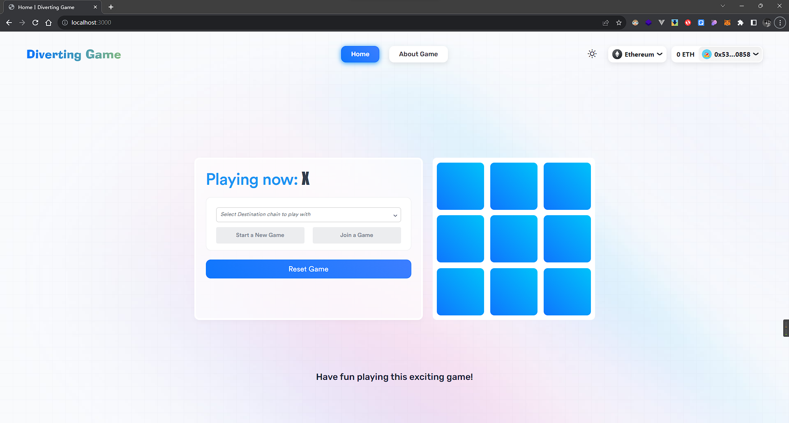

# About Diverting Game（Tic-Tac-Toe）

Tic-Tac-Toe is a simple and popular strategy board game that is typically played by two players. The game board consists of a 3x3 grid, and players take turns placing their respective markers on empty squares with the goal of forming a line horizontally, vertically, or diagonally.

## Game Rules

1. The Tic-Tac-Toe board is a 3x3 grid with a total of 9 positions for players to place their markers.
2. Player 1 uses "X" as their marker, and Player 2 uses "O".
3. The game starts with an empty board, and Player 1 goes first.
4. Each player takes turns selecting an empty square and placing their marker on that position.
5. Players try to form a line horizontally, vertically, or diagonally to win the game.
6. If the board becomes full and no player has formed a line, the game ends in a draw.
7. If any player successfully forms a line, they win the game.
8. The game can be restarted once it is finished.
 

That concludes the introduction to Tic-Tac-Toe. Have fun playing this exciting game!






## Prerequisites

- [Git](https://git-scm.com/book/en/v2/Getting-Started-Installing-Git)
- [Current LTS Node.js version](https://nodejs.org/en/about/releases/)

Verify installation by typing:

```shell
node -v
```

and

```shell
npm -v
```

## Getting Started

1. Install packages

```
npm install
```

2. Compile contracts

```
npx hardhat compile
```
Comment out `import './tasks'` line in the file `hardhat.config` if you have issue of it. Please don't forget uncomment the line after compiling.

3. Run tests

```
TS_TRANSPILE_NODE=1 npx hardhat test
```

With Chainlink TicTacToe, one can:

- Transfer supported tokens
- Send messages (any data)
- Send messages and tokens

 receiver can be:

- Smart contract that implements `CCIPReceiver.sol`
- EOA

**Note**: If you send a message and token(s) to EOA, only tokens will arrive

To use this project, you can consider CCIP as a "black-box" component and be aware of the Router contract only. If you want to dive deep into it, check the [Official Chainlink Documentation](docs.chain.link).
 
